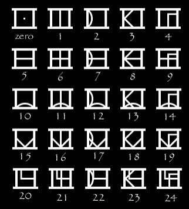

# 胡闹WP

## 考点

古典密码，搜索能力

## WP

提示到贴吧里找，经过一番搜索找到如下五个代替表

然后就是单表代替，得到替换后的内容`}hjq!kzoh91_qwl_x1Z0{diljhAk_j`。

方片K是凯撒，经典凯撒密码密钥是3，本题也是如此：`}egn!hwle91_nti_u1Z0{afigeXh_g`

根据提示是三层栅栏和flag格式为`flag{***********}`匹配花括号位置，确定加密方式为W型三层栅栏，还原出`}ei9e1g_gnetniX_!uh1hZ_0w{galf`,直接逆序得到flag。

（因为跳舞的小人大小写不确定，故flag设置为大小写不敏感。）
