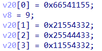

## little_star

​	题名为little_star，题目描述为：
​					*只有找到了正确的钥匙，朴素的歌曲才会完整显现*
​	因此可以猜测出题人是在程序里设置了一首歌曲，而歌曲的名字是little_star
题目里调用了很多蜂鸣器函数Beep()，如下图所示：


	如上图所示，总共大段调用Beep()的有四段，这里可以动态调试设置eip或者编程听一听这四段Beep()的旋律，**注意打开电脑的蜂鸣器**，方法百度即可。
	可以分析出程序设置了一个**变量**，如果这个变量的值为0x37BF，蜂鸣器奏响旋律（以下为简谱）1155665，0x0EAC:5544332，0x523D:44332215544332，0x76A3:11556i54433221。
	这个变量的值为将加密结果每两个字节向后扫描，扫描到上面对应的值发出声音，当发声为小星星的歌曲的时候，程序解密成功。



密钥在这里，这是个idea的加密算法。由于本题0解，故放上解密程序源代码：

```c
#include <stdio.h>
#include <windows.h>

#define one 	65535
#define round	8
#define maxim 	65537

unsigned inv(unsigned xin)
{
	long n1, n2, q, r, b1, b2, t;
	if (xin == 0) b2 = 0;
	else
	{
		n1 = maxim; n2 = xin; b2 = 1; b1 = 0;
		do {
			r = (n1 % n2); q = (n1 - r) / n2;
			if (r == 0) { if (b2 < 0) b2 = maxim + b2; }
			else { n1 = n2; n2 = r; t = b2; b2 = b1 - q * b2; b1 = t; }
		} while (r != 0);
	}
	return (unsigned)b2;
}

#define fuyi	65536

unsigned mul(unsigned a, unsigned b) //算模乘法
{
	long int p;
	long unsigned q;
	if (a == 0) p = maxim - b;
	else
		if (b == 0) p = maxim - a;
		else {
			q = (unsigned long)a * (unsigned long)b;
			p = (q & one) - (q >> 16);
			if (p <= 0) p = p + maxim;
		}
	return (unsigned)(p & one);
}


void key(unsigned short uskey[9], unsigned short Z[7][10])
{
	unsigned short S[54];
	int i, j, r;
	for (i = 1; i < 9; i++) S[i - 1] = uskey[i];
	/* shifts */
	for (i = 8; i < 54; i++)
	{
		if ((i + 2) % 8 == 0)			/* for S[14],S[22],... */
			S[i] = ((S[i - 7] << 9) ^ (S[i - 14] >> 7)) & one;
		else if ((i + 1) % 8 == 0)			/* for S[15],S[23],... */
			S[i] = ((S[i - 15] << 9) ^ (S[i - 14] >> 7)) & one;
		else
			S[i] = ((S[i - 7] << 9) ^ (S[i - 6] >> 7)) & one;
	}

	/* get subkeys */

	for (r = 1; r <= round + 1; r++)
		for (j = 1; j < 7; j++)
			Z[j][r] = S[6 * (r - 1) + j - 1];
}

void cip(unsigned short in[5], unsigned short out[5], unsigned short Z[7][10])
{
	unsigned r, x1, x2, x3, x4, kk, t1, t2, a;
	x1 = in[1]; x2 = in[2]; x3 = in[3]; x4 = in[4];
	for (r = 1; r <= 8; r++) 			/* the round function */
	{
		/* the group operation on 64-bits block */
		x1 = mul(x1, Z[1][r]);		x4 = mul(x4, Z[4][r]);//算模乘法 65537
		x2 = (x2 + Z[2][r]) & one;	x3 = (x3 + Z[3][r]) & one;  //算模加法65536
				/* the function of the MA structure */
		kk = mul(Z[5][r], (x1 ^ x3));
		t1 = mul(Z[6][r], (kk + (x2 ^ x4)) & one);
		t2 = (kk + t1) & one;
		/* the involutary permutation PI */
		x1 = x1 ^ t1;		x4 = x4 ^ t2;
		a = x2 ^ t2;		x2 = x3 ^ t1;	x3 = a;
	}

	/* the output transformation */
	out[1] = mul(x1, Z[1][round + 1]);
	out[4] = mul(x4, Z[4][round + 1]);
	out[2] = (x3 + Z[2][round + 1]) & one;
	out[3] = (x2 + Z[3][round + 1]) & one;
}

void de_key(unsigned short Z[7][10], unsigned short DK[7][10])
{
	int j;
	for (j = 1; j <= round + 1; j++)
	{
		DK[1][round - j + 2] = inv(Z[1][j]);
		DK[4][round - j + 2] = inv(Z[4][j]);

		if (j == 1 || j == round + 1) {
			DK[2][round - j + 2] = (fuyi - Z[2][j]) & one;
			DK[3][round - j + 2] = (fuyi - Z[3][j]) & one;
		}
		else {
			DK[2][round - j + 2] = (fuyi - Z[3][j]) & one;
			DK[3][round - j + 2] = (fuyi - Z[2][j]) & one;
		}
	}

	for (j = 1; j <= round + 1; j++)
	{
		DK[5][round + 1 - j] = Z[5][j];
		DK[6][round + 1 - j] = Z[6][j];
	}
}

int main() {
	WORD wSN[5] = { 0 };
	WORD wSubKey[7][10] = { 0 };
	WORD DK[7][10] = { 0 };
	WORD wiDeaKey[9] = { 0, 0x1155, 0x6654, 0x4332, 0x2155, 0x4433, 0x2554, 0x4332, 0x1155 };
	WORD wCipherText[5] = { 0, 0x37bf , 0x523d, 0x0eac, 0x76a3};


	key(wiDeaKey, wSubKey);
	de_key(wSubKey, DK);
	cip(wCipherText, wSN, DK);

	for (int i = 1; i < 5; i++) {
		printf("%x", wSN[i]);
	}
	return 0;
}
```

flag为：flag{bling*~!}		
