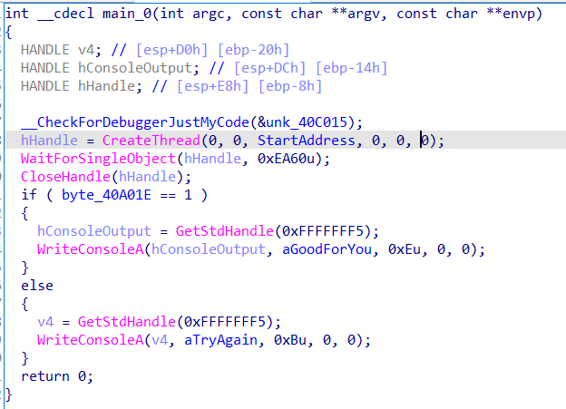
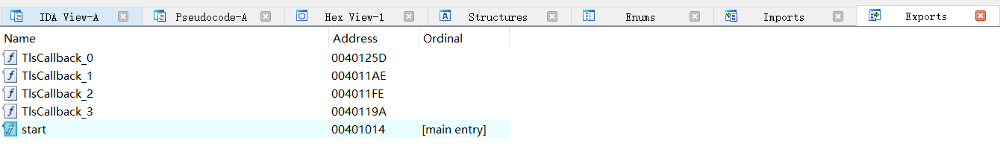

## tls

本题使用了tls回调函数，定义：

```c
typedef VOID
(NTAPI *PIMAGE_TLS_CALLBACK) (
 PVOID DllHandle, 
 DWORD Reason, 
 PVOID Reserved
 );
```

其中Reason有以下几种参数
\#define DLL_PROCESS_DETACH 0 进程退出
#define DLL_PROCESS_ATTACH 1 进程启动
#define DLL_THREAD_ATTACH 2  线程启动
#define DLL_THREAD_DETACH 3  线程退出

我们进入IDA看主函数



打开Exports，发现TlsCallbaclk，如图所示，点进每个函数看一看



程序的整体执行流程：

​    进入TlsCallback_0，当Reason==1的时候，也就是进程启动之前，执行tls回调函数，打印出来“Please input the flag\n.”
​	TlsCallback_1，当Reason==2，也就是线程启动之前，执行回调函数，这个函数的作用是获得用户输入，比较字符串的格式是否为flag{...}样式，最后将用户输入和程序中的全局变量异或，存入全局变量中。
​	进入程序创建的线程里面，将全局变量的值和线程函数中的局部变量异或，存入全局变量中。
​	TlsCallback_2，将全局变量的值和函数局部变量的值进行比较，如果全部相等则全局标志位置为1。
​	回到主函数，判断全局标志位是否为1，如果为1，那么就会在Console打印"good for you！"，否则会弹出"try again!"

​	所以将**TlsCallback_2局部变量数组**取出，和**线程函数的局部变量数组**值异或，再和**全局变量数组**的值异或，就会得到flag{tls_a_method_for_antidebugging}
