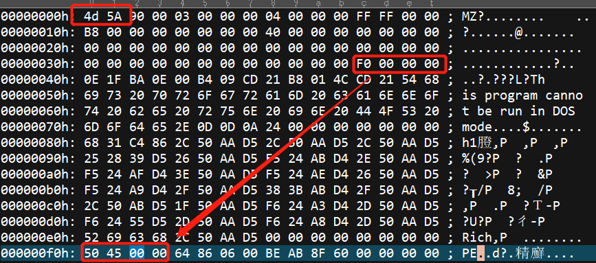
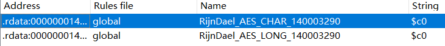

## 损坏的文件头

​	直接运行会得到如下提示，是因为出题人将DOS头和PE头的魔数改掉了。


​	关于PE头和DOS头的修改，建议学习下[PE头的有关知识](https://blog.csdn.net/Apollon_krj/article/details/77069342)，这个题只需要用16进制编辑器打开文件，然后将偏移为0的位置改为4d 5a，偏移为f0h的位置改为50 45。

​	IDA打开文件，发现取到的密钥正好与刚刚修改过的字段有关，为四个**4d 5a 50 45**重复，使用IDA插件Findcrypt，可以看到

​	如果不确定的话，可以直接看反编译出的代码，能看到是一个ECB模式加密的AES算法，密钥长度4，分组长度4，加密轮数10，加密结果和下面比较

```c
{0xf1,0x56,0x08,0xbb,0xd9,0x72,0x8a,0xfc,0x55,0xd3,0xb4,0x7e,0xc0,0x9b,0x6e,0x1e
	,0x82,0xab,0xb9,0x6f,0xaf,0xa3,0x6f,0xa2,0x38,0xb2,0xdf,0x07,0xec,0x9a,0x30,0xd0}
```

​	所以上面的做密文，密钥为上面的粗体重复了四次，解密得到flag：
​							flag{huruinan_ni_xiang_tian_xia_di_yi}
